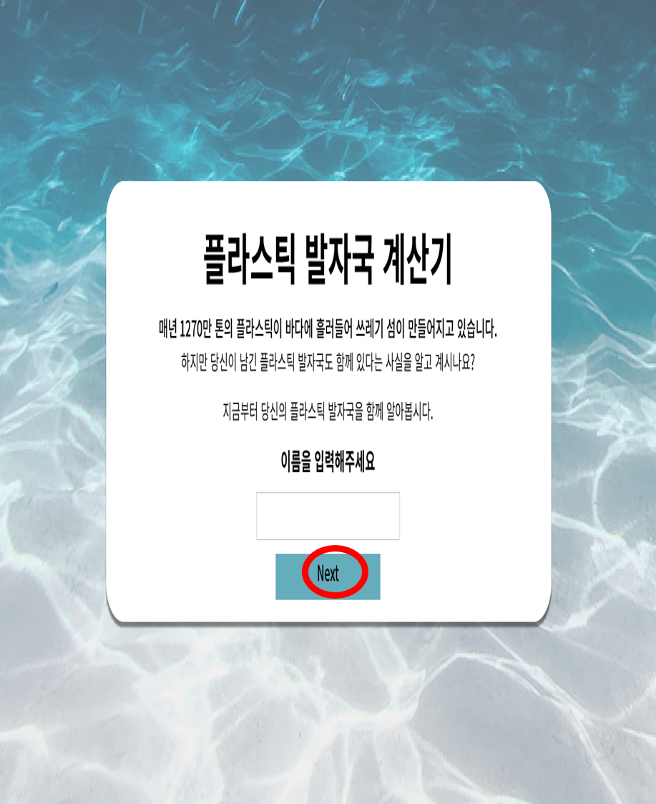
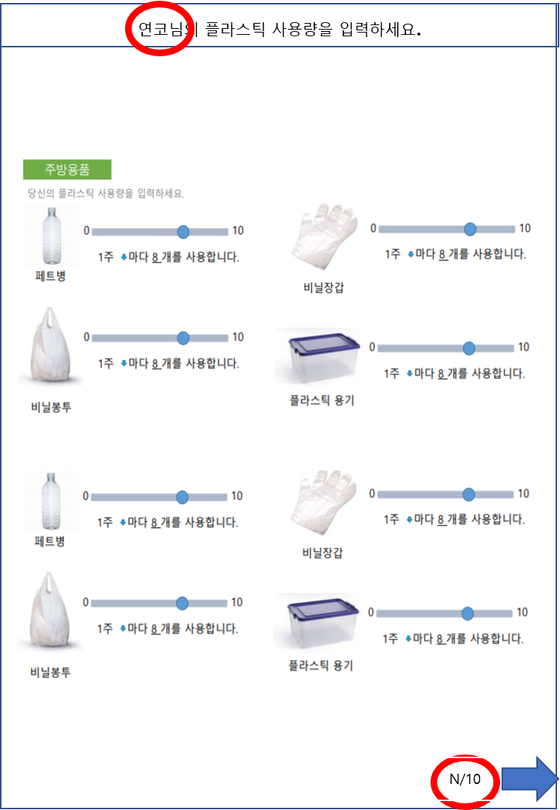
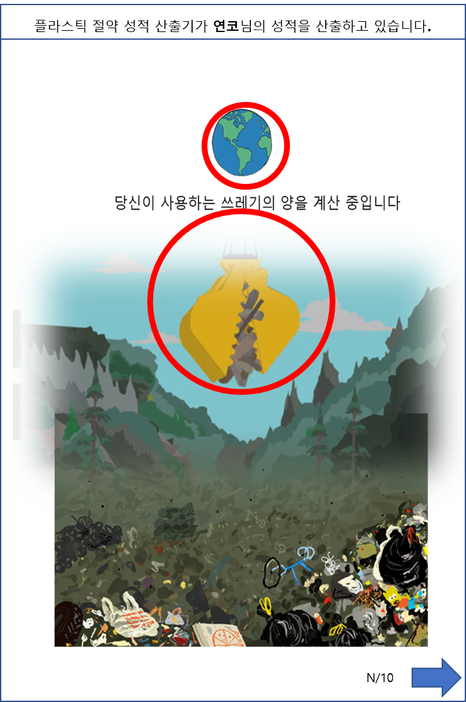
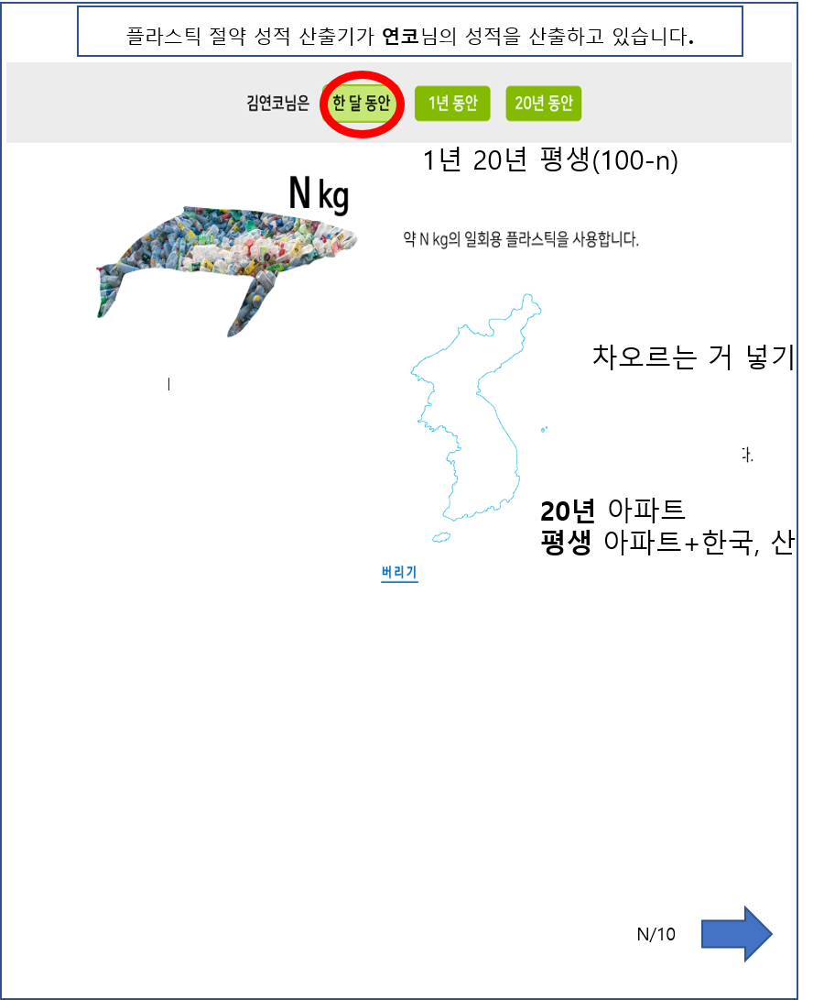
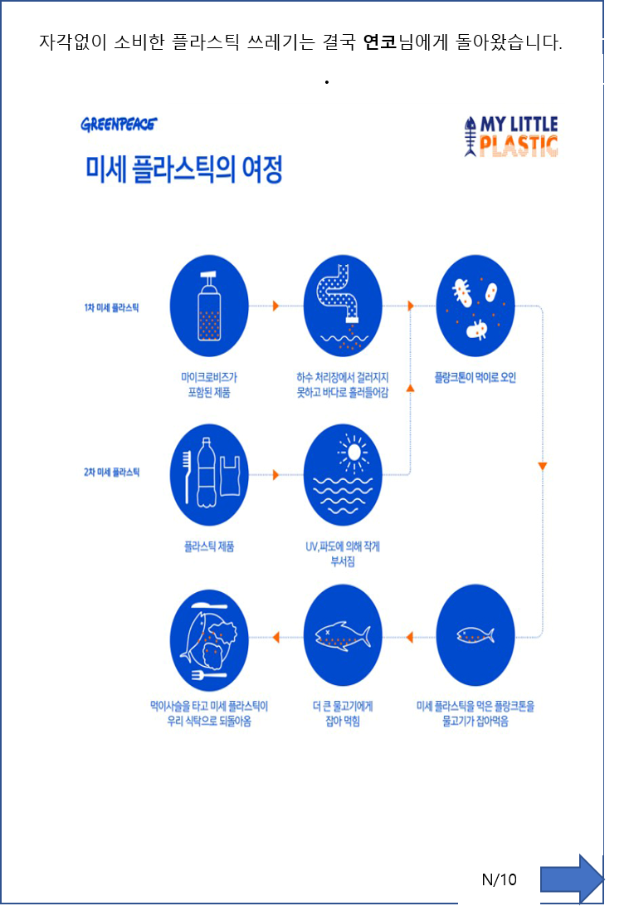
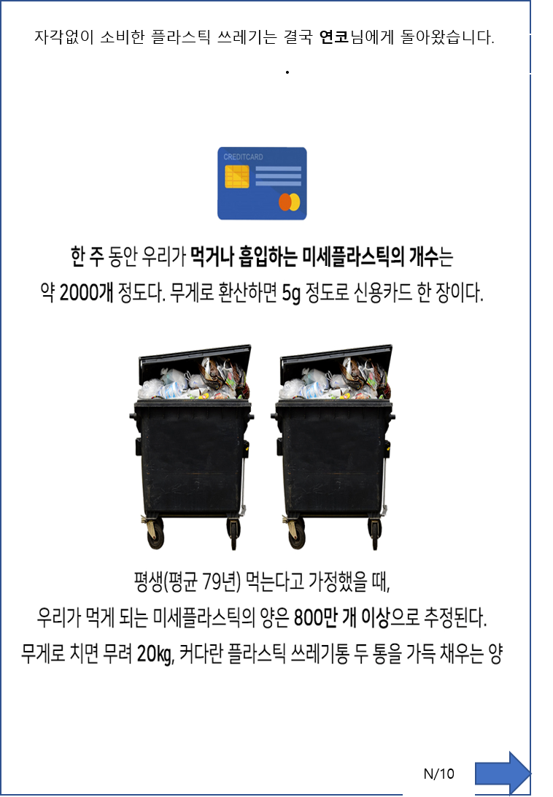
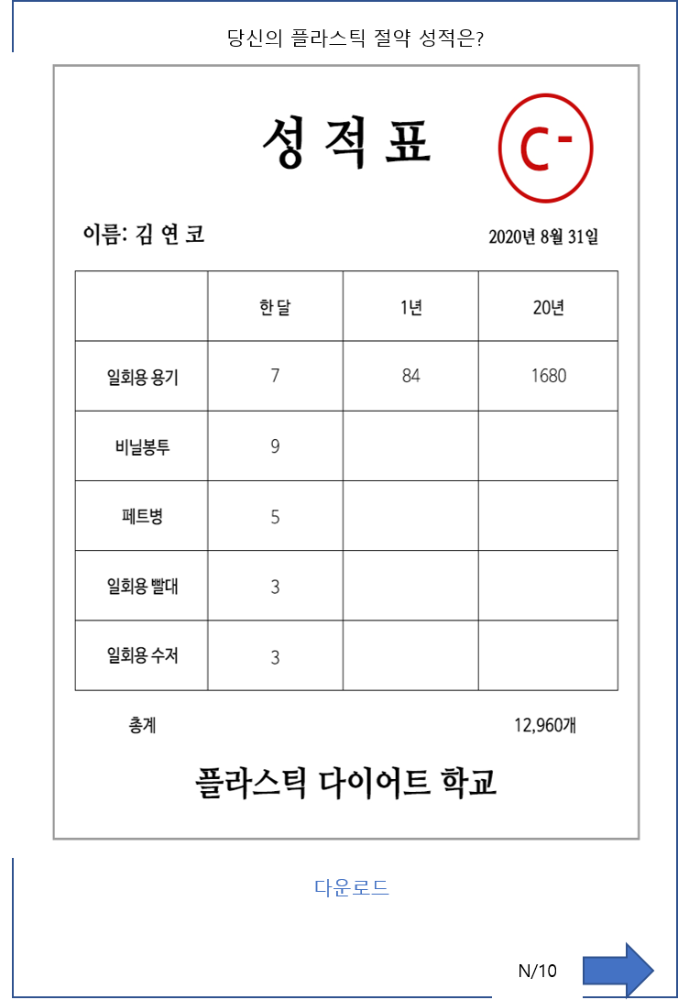
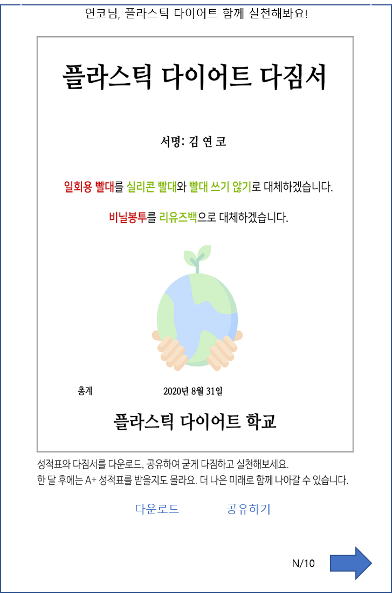

# 플라스틱 발자국 계산기

 

### 1. 개발 목적

* 플라스틱 사용량을 설문조사 형식으로 만들어, 그에 따른 결과를 플라스틱 절약 성적으로 산출
* 산출 결과를 이미지로 시각화 하여 사용자에게 보여주기 위한 웹 페이지 구현
* 이로 인해 경각심을 가지고, 플라스틱 사용을 줄이는데 실천을 유도하기 위한 캠페인의 일환

 

### 2. 화면 레이아웃 설계

#### 1번째 페이지 (메인 예상화면)

* 배경 이미지, 중앙 글자 입출력 구역으로 나뉨 (**배경 이미지 필요**)
* 제목과 계산기 시작 안내 문구
* 이름 입력 탭 (이 정보를 앞으로 name 이라고 명명)
* Next 버튼으로 탭 정보 전달 및 다음 페이지로 이동

 

#### 2번째 페이지 (설문조사 예상화면)

* 상단 출력 구역, 중앙에 항목마다 값을 선택하는 구역 존재
* 앞 페이지에서 입력받은 name 정보와 안내문구 출력
* 안내 문구, 항목에 대한 이미지, 값을 선택 가능한 버튼, 선택 값에 따른 출력 및 안내 문구 (**이미지들 필요**)
* 현재 페이지/전체 페이지 수 안내 문구 출력
* 화살표 버튼으로 탭 정보 전달 및 다음 페이지로 이동

 

#### 3번째 페이지 (결과 출력 전 대기 예상화면)

* 상단 출력 구역, 중앙에 이미지 및 안내 메시지 출력 구역
* name 정보와 안내문구 출력
* 동적 이미지 (gif 등) 애니메이션 2개 출력 (**gif 형태 이미지, 배경 이미지 필요**)
* 현재 페이지/전체 페이지 수 안내 문구 출력
* 화살표 버튼으로 다음 페이지로 이동

 

#### 4번째 페이지 (성적 산출 결과1 예상 화면)

* 상단 출력 구역, 버튼 클릭 구역, 이미지 및 안내 메시지 출력 구역
* name 정보 출력, 한달 / 1년 / 20년 버튼 선택 가능
* 선택한 버튼에 따른 값 및 이미지 출력 결과 다름 (**각 이미지 필요**)
* 값에 따른 연도별 성적 산출 계산식 필요
* 현재 페이지/전체 페이지 수 안내 문구 출력
* 화살표 버튼으로 다음 페이지로 이동

 

#### 5번째 페이지 (성적 산출 결과2 예상 화면)

* 상단 출력 구역, 이미지 출력 구역
* name 정보 출력, 안내 이미지 출력 (**이미지 필요**)
* 현재 페이지/전체 페이지 수 안내 문구 출력
* 화살표 버튼으로 다음 페이지로 이동

 

#### 6번째 페이지 (성적 산출 결과3 예상 화면)

* 상단 출력 구역, 이미지 출력 구역
* name 정보 출력, 안내 메시지 및 이미지 출력 (**이미지 필요**)
* 현재 페이지/전체 페이지 수 안내 문구 출력
* 화살표 버튼으로 다음 페이지로 이동

 

#### 7번째 페이지 (성적 산출 결과4 예상 화면)

* 상단 출력 구역, 이미지 출력 구역
* name 정보 출력, 안내 메시지 및 이미지 출력 (**이미지 필요**)
* 현재 페이지/전체 페이지 수 안내 문구 출력
* 화살표 버튼으로 다음 페이지로 이동

 

#### 8번째 페이지 (성적 산출 결과5 예상 화면)

* 상단 출력 구역, 안내 메시지 및 이미지 출력 구역, 다운로드 공유하기 출력 구역
* name 정보 출력, 안내 메시지 및 이미지 출력 (**이미지 필요**)
* 검사한 날짜 년 월 일 출력
* 다운로드, 공유하기 버튼 입력 가능 (해당 이미지 다운로드 / 공유하기 버튼 누르면 링크 복사)
* 현재 페이지/전체 페이지 수 안내 문구 출력
* 마지막 페이지라서 화살표 대신 Home으로 가는 기능을 넣으면 차라리 좋을 듯

 

### 3. 비즈니스 요구사항 정리

* 데이터 : 이름(닉네임), 항목별 사용량(개수), 누적 페이지 수, 계산된 정보(Kg, 합계, 성적 등)
* 기능 :
  * 이름(닉네임) 등록
  * 버튼
    * 다음 페이지 이동
    * 항목별 사용량(개수) 선택
    * 이미지 다운로드
    * 링크 복사
  * jpg 및 gif 형식 이미지 출력
* 컨트롤러 : 웹 MVC의 컨트롤러 역할
* 서비스 : 핵심 비즈니스 로직 구현 (플라스틱 계산기)
* 리포지토리 : ?
* 도메인 : 비즈니스 도메인 객체

 

### 4. 개발 방법

#### View 적인 요소

* 반응형 웹 형태로 하여 PC 또는 스마트폰에서 볼 수 있도록 개발
* HTML CSS, Javascript 및 라이브러리를 사용하여 개발

 

#### Server 및 Data 처리에 대한 요소

* Java 언어를 선택, Spring 프레임 워크로 개발
* MVC 패턴 적용 (Model, View, Controller)
* 데이터는 JSON 형태로 주고 받기
* 서버는 최대한 무료 - azure 학생 계정 or githubio or AWS(는 과금 경험 때문에 지양...)

 

### 5. 개발을 위해 필요한 분야

* HTML CSS 및 Javascript
* Java Spring Framework
* Server-Client간 Data의 흐름 개념
* JSON 타입