## 개발하면서 막힌 부분

<br/>

### 좀비 프로세스

* 서버를 올린 다음 종료하지 않고 IDE가 꺼지는 등의 상황을 이유로, "port 8080이 이미 사용중"이라는 내용의 오류를 맞딱드리게 되었다.
* 서버는 실행중이긴 하지만, 실행한 주체와 연결이 끊겨 종료할 수 없는 상황. 방법은 두 가지였다. 서버를 8080이 아닌 다른 포트로 바꿔서 실행하던가 (굳이?), 아니면 기존의 실행중인 서버를 종료하던가.
* 후자를 선택했다. 윈도우 cmd를 열어서 명령어를 입력한다.
  * netstat -ano : 현재 작동중인 전체 포트를 확인한다.
  * netstat -ano | findstr 8080 : 그 중에 8080을 포함하는 문자열을 검색한다.
  * 
* 그럼 실행중인 전체 포트 중 8080을 포함한 포트만 출력한다. 다음 명령어를 입력한다.
  * tasklist /FI “PID eq 20056” : 해당 PID가 어떤 프로그램인지 확인한다.
  * 
  * taskkill /F /PID 20056 : PID를 이용해 특정 포트를 종료시킨다.

[참고](https://dullyshin.github.io/2019/08/30/window-checkport/)

<br/>

### 이미지 경로

* HTML 파일을 직접 열 때는 이미지가 출력이 되었는데, 스프링 서버를 올린 다음 localhost:8080으로 들어가면 이미지가 출력되지 않는 오류가 있었다.

* 스프링 부트를 쓰며 thymeleaf 를 사용한 후에는 src/main/resources 를 루트로하여 static 폴더에 넣으면 이미지 경로를 절대경로처럼 사용할 수 있었다.

* 예를 들어, static/images/boyeong.gif 파일을 사용하려 한다면 다음과 같은 경로로 사용하면 된다.

  * ```html
    background-image: url([/]images/boyeong.gif);
    background-image: url("[/]images/boyeong.gif");
    ```

[참고](http://mattdevils.blogspot.com/2016/08/20160821-spring-boot-thymeleaf-image.html)

<br/>

### Github 잔디 . . .

* 매우 속상한 일을 발견했다. 근 한달간 열심히 깃허브에 공부한 자료들을 올렸는데... new repository를 제외한 모든 commit에 대해 잔디가 하나도 심기지 않았다... 어째서 인지하지 못했을까.
* 물론 잔디가 심기는 것 자체는 자기 만족이지만... 너무 큰 의미의 자기 만족이라... 매우 속상했다.
* 
* 원인을 발견했다. 지금으로부터 약 한달 전, 8월 28일. github에 관한 내용을 후배들한테 알려주려고 실습을 하며 내 local 저장소와 매칭된 email을 수정하는 방법을 할 때, 잘못된 이메일을 입력했었다.
* git config user.email 명령어를 입력하면 뒤에 "내 이메일 주소"가 출력된다. 하지만... sanggoe0509@gmail 까지만 쓰여있더라. .com 어디갔어..ㅠ
* gic config --global user.email "내 이메일 주소" 형식으로 다시 수정하여 지정한 후 다시 테스트 겸 commit을 해보니 아주 잘 된다.
* 한달간의 기록... 아쉽다... 흰색보다 초록색이 더 무성한 잔디밭이 될 수 있었는데... 그치만 조금이라도 빨리 그보다 더 값진, 새로 알게된 사실이 있으니 다행이다.

<br/>

### HTTP

#### Get

* 

#### Post

* 

아아아아아ㅏ아아아아아아아ㅏ아아아아ㅏ아 나중에 할래.... 의욕상실

<br/>

### JSP, Servlet, Java, JS

[참고](https://defacto-standard.tistory.com/m/236)

<br/>

### Client - Server 간 데이터 이동 - 단일 데이터 전달

#### First issue


* 사진과 같이, 버튼을 누르면 Sanggoe라는 input tag 안의 데이터를 전달하고, 해당 데이터를 반영한 다음 html 페이지를 보고싶은 것 이었다.
* 위 사항의 경우, name 이라는 데이터 ''하나'만 전달하여 다음 페이지를 요청하고 싶은 경우였지만... 이 마저도 spring boot 프로젝트는 처음이라... 어려움을 겪었다.
* 내가 적게나마 이해한 정도는, client에서 요청을 보내는 action을 html 태그 속성으로 넣어주면, 그에 해당하는 url과 @GetMapping 된 함수를 수행한다는 것. 그리고, 수행한 뒤 결과값을 반환하는 것. 그 정도였다.
* 매개변수로 [?key=value] 형태로 넘어가는데, 어떤 형식으로 주고, 전달 받은 값을 다시 어떻게 html 파일에 보내서 적용을 시켜야 할지.. 되게 막막했던 것 같다.

<br/>

#### 전체적인 그림

* 우선 클라이언트 측을 처음 View, html 페이지 라고 보자. 여기서 name을 입력한 다음, 버튼을 눌러 서버에 name을 파라미터로 주면서 Get 방식으로 다음 페이지에 대한 요청을 보낸다.
* 서버는 Controller가 있는지 먼저 살핀다. 존재한다면 Controller는 보내온 요청 url에 대해 @GetMapping 으로 매핑 되어있는 함수를 실행시켜준다.
* 이 매핑된 함수는 전달받은 데이터를 사용하여 html 문서에 반영한 후, 해당 html 문서를 return 한다.

<br/>

#### Solution


* 먼저 Javascript 함수의 도움을 받았다. inputText() 함수는 name이란 id를 가진 태그의 value를 가져와 data에 저장하고, 경로를 string으로 합쳐서 name이라는 매개변수 이름을 가진 'data' 즉, input tag에 입력한 value를 값으로 전할하는 url을 만든다.

<br/>


* Controller에서는, 상대 경로에 대한 url을 value로 받아 @GetMapping 시킨 함수를 실행한다. 이 때, 클라이언트가 요청한 것은 data가 적용된 survey1 이라는 html 파일이다.

##### @RequestParam

* 위를 예시로 들면, @RequestParam("name") String name 이다. get 방식에서 파라미터를 전달하는 방식은 [경로?key=vlaue] 이므로.. 여기서 "name"은 key를 말하고, name은 String 형식의 value를 말한다. 

##### Model

* Model 이라는 Class가 존재한다. MVC 패턴에서는 이 모델을 통해서 데이터 전달이 이루어진단다. 즉 내 경우, 전달 받은 데이터를 다음 페이지인 html에 적용시키기 위해서 전달에 필요한 1회용 임시 변수 Temp와 같은 역할이라고 한다. 
* model.addAtrribute() 함수를 이용해 (key, value) 매개 변수로 넘겨주면 return 하는 해당 html 파일에서 그 값을 적용한다.

##### UserInformation field

* 아직 스프링의 이해도가 낮다보니, 사실 방법을 잘 몰라서 무작정 해보고 선택한 방법이다. DB의 필요성 까지는 전혀 못느끼겠고, 해당 웹 페이지를 종료하기 전까지만 데이터가 유지되면 되므로 Controller에 데이터에 해당하는 클래스를 선언하여 field로 두었다.
* MVC 패턴이라는 개념을 적용한다고 하면, 솔직히 좋은 방법이 아니지 않을까.. 생각이 들지만 아직 잘 모르겠다. 우선은 구현 자체에 목적이 있으므로 좋은 습관이 아니더라도 일단 구현해보고, 추후에 코드 리뷰를 하면서 고치는 방법을 선택해야되겠다.

<br/>

##### HTML 파일에 데이터 적용


* thymeleaf 템플릿을 사용하였다. 위와 같이, ${name} 형식으로 model에 더해진 값에 대해서 순차적으로 적용이 된다. 이렇게 적용된 html 페이지는 return 되어 클라이언트에게 반환된다.

<br/>

### Client - Server 간 데이터 이동 - 여러 데이터 전달

#### second issue


* 처음에는 데이터가 이름 하나였지만, 뒤쪽에서는 처리해야 할 데이터가 여러 가지였다. 이 데이터를 어떻게 넘기고, 어떻게 저장하지? 하는 고민에 또 다시 잠기게 되었다.

<br/>

#### Solution


* 우선, 요번에는 input 태그에서 Javascript 함수를 이용하는 것이 아니라 form 태그의 action 속성 그리고 method 속성으로 post 방식을 선택하였다.

<br/>


* input 태그를 이용하여 버튼 슬라이드의 값을 input 태그 text type에 실시간으로 출력하고, submit type을 통해서 제출(요청)하는 방식이다.
* 전달할 데이터가 많으므로 Get 방식이 아닌 Post 방식을 선택하였다.
* (처음 할 때는 복수개의 데이터 2개만 전달하는 것으로 테스트 하였다)

<br/>


* controller에서 @PostMapping 된 함수를 실행한다.
* 추후 실제 코드에서는 각각 key의 이름과 변수 이름 등을 수정해야겠지만,  (key=value) 쌍을 두 개 받아 model에 넣어주는 테스트 예시 코드였다. 이렇게 하면 단일 값 전달과 마찬가지 방식으로 return 하는 html 파일에 model을 통해 데이터가 전달 되었다.

<br/>

### UI 적인 문제

#### 슬라이드 버튼


*  Javascript 함수의 힘을 빌렸다. 해당 Id의 value를 실시간으로 반영할 수 있도록 작성하였다. 위와 같은 방법으로 잘 구현 되었다.

<br/>

### Client - Server 간 데이터 이동 - 실시간 Data 중복 문제

#### Third issue

* 혼자 테스트 할 때는 나만 접속하니까 상관 없지만, 결국 이 페이지들과 내장 톰캣서버 등 프로젝트를 완성한 후에는 서버에 올리는 것이 목적이다. 그럼 여러 사람이 접속하여 서버에 동시에 Request들을 보낼 수도 있다.
* 그런데, 위에서 Controller에 field로 선언한 방식으로 한다면 UserInformation은 Sigleton 방식으로 단 하나의 객체만 생성이 된다. 즉, 여러 사람이 Request를 반복하다 보면 하나의 객체에 다른 요청이 여러번 와서 해당 객체의 필드 내용이 뒤죽박죽 섞이게 된다. 아마 최종적으로는 가장 마지막에 요청한 사람이 전달한 정보가 저장되겠지.
* 처음부터 끝까지 순서대로 한 번에 한 명씩만 접속해서 웹 어플을 사용한다면 결과상으로 문제될 것은 없다. 하지만 실제로는 절대 그럴 일이 없으니.. 요청이 들어오면 실시간으로 객체 내부 값을 변경도 하고 또 그 값을 반환하는 서버의 특성상, 데이터가 저장될 객체 내부에 원치 않는 값들이 섞이는? 문제가 발생한다. (동시에 두 웹 브라우저 창에서 test를 진행해보니 걱정했던 대로 동일한 문제가 발생하였다.)

<br/>

#### solution

* 우선 Spring에서 객체를 전달하는 방법은 'JSON 타입'을 사용하는 것이 거의 표준안처럼 사용된다고 한다. 하지만 반환을 view가 아닌 딱 그 '데이터'만 반환을 한다는 것 까지만 알 뿐 어떻게 활용하는지는 아직 잘 모르겠다.
* 그 외에도 Spring에서 데이터를 주고 받는 방법에는 Session을 두고 데이터를 넣어서 사용하는 방법, data를 태그의 value로 넣고 hidden으로 감추어 사용자에게는 보이지 않게 전달하는 방법 등 여러 가지가 있는데, 노가다 형식이긴 하지만 지금 이해도로 활용할 수 있는 가장 간단한 방법이므로 선택하였다. But, 이 방법을 쓰면 만들었던 UserInformation 클래스는 사용할 필요가 없다.
  * HttpServletRequest 방식 /  VO 방식 / @RequestParam 이용 방식 등이 있다고 한다.  [참고](https://pjh3749.tistory.com/134)

<br/>


* @RequestParam을 이용해 파라미터로 넘겨받고, Model 객체를 이용해 다음 view에 데이터를 넘겨준다. 위에서 살펴보았듯, model 객체는 view 페이지에 데이터를 넘겨주는 임시 변수 역할을 하는 객체였다. 따라서 1회성으로.. 매번.. 이렇게.. 페이지마다 늘어나는 많은 정보를.. 넘겨주는 방법을 선택했다..
* 정말... 이 방법이 최선인 것일까? 분명히 절대로... 최선은 아닐 것이다. 정말 하나하나 매 페이지마다 이런식으로 값을 저장하고 넘겨주는 것은 노가다 방법이다. 동전 분류기가 있는데도 굳이 하나하나 사람 손으로 분류하여 넣는 기분이랄까. 하지만 어쩔 수 없다. 우선 기술보다는 결과물 완성이 더 급하고, 다른 것을 공부해서 사용하기엔 마음이 조급하다. 우선은 결과적으로 '작동 되면' 넘어가기로 했다. 이 부분 역시 완성이 된 후에 코드 리뷰를 통해 다른 방법으로 보완 및 공부하기로.
* 테스트 해보니 동시에 다른 Request들이 반복 되어도, client가 요청한 '페이지마다' data가 hidden 상태로 저장되므로, data가 중복되는 문제는 해결은 되었다. 맘에는 안들지만..

<br/>

### Client - Server 간 데이터 이동 - Error Page!

#### fourth issue


* 오랜 시간 고뇌에 빠졌다. 도대체 왜... 전에는 되던 데이터 처리가 다른 방법으로 바꿔서 하려니 안되는 것일까?

<br/>

```
This application has no explicit mapping for /error, so you are seeing this as a fallback.

There was an unexpected error (type=Internal Server Error, status=500).

An error happened during template parsing
```

* 저 기나긴 에러속에서 내가 주목한 에러들이다. 매핑?? 매핑이 잘못된걸까?? 하지만 저 노가다 방식으로 바꾸기 전에는 데이터 전달이 너무나도 잘 되었는걸..

<br/>


* 그래도 혹시 몰라 매핑하는 부분, Controller쪽의 코드를 살펴 보았다. 하나하나 따라가 봐도 노가다로 하나하나 넘겨주는게 맘에 안들 뿐, 문법적인 오류는 없었다. 받아오는 파라미터나 변수, 그리고 모델에 넘겨주는 key - value 값들에 대한 매핑도 하나하나 잘 되어있었다.

* 또 다른 문장... Unexpected error... 예상치 못한 에러란다. 동일한 에러 메시지가 발생한 다른 경우들을 검색해보았다. @RequestParam이나 기타 파라미터 값을 받아올 때 null이거나, Type이 맞지 않는 경우 이 에러가 발생한다고 한다.

<br/>


* 페이지 소스코드 보기를 눌러, 데이터를 넘겨 hidden으로 값을 준 부분에 value가 잘 들어가 있는 것을 확인할 수 있었다. 그럼 null 값이라서 발생한 문제는 아니라는 건데... 그럼 Type 에러인 걸까?

<br/>

* 근데, 내가 출력하려고 시도했던 데이터를 주석처리 하면 에러가 발생하지 않았다. 게다가 input tag의 value에 데이터가 잘 들어간걸 보면 문제 없이 데이터가 넘어왔다는 말 아닌가. 그래서 혹시 몰라 데이터를 하나하나 나누어서 출력 해보게 되었다.


* It works! 잘 되더라. 그럼... 설마..?

<br/>


* 이럴수가. 너무도 사소한 실수였다. 너무나 단순한 문법 오류로 인한 문제. 마지막에 +를 넣고 끝낸 것이 문제였다. html 페이지 출력할 때는 문법적으로 안맞으면 그냥 무시되고 적용이 안된 상태로 출력되던데... 역시.. '문법'적인 오류는 철저한 것 같다.
* 서버에서 데이터 매핑이 잘못되거나 한 오류가 있다면 가장 기초적인 문법 오류부터 체크해야 되겠다...

[참고](https://dondons.tistory.com/19)

<br/>

#### 서버 관련 !500 error 메시지

* 방금 발생한 에러는 !500 error로, 예외적이거나 예측하지 못한 경우 출력된다.
* 발생한 원인으로는 대표적으로 다음 세 가지가 있다고 한다.
  * Request Time out
  * Traffic 과부하
  * Syntax Error
* 이 중 내 경우에는 세 번째. 가장 단순한 Syntax Error가 자주 있었다. 문장 끝에 +를 하나 더 쓰고 그 뒤에 값을 안 줬다던지, 문자열을 따옴표 '로 열고 안 닫아줬다던지..
* 그 외에도 300, 400 등 자주 발생하는 에러 메시지의 종류에는 여러 가지가 있으니 참고하자.

[참고](https://webisfree.com/2017-04-27/internal-server-error-%EC%84%9C%EB%B2%84-500-%EC%97%90%EB%9F%AC%EB%8A%94-%EC%96%B4%EB%96%A4-%EA%B2%BD%EC%9A%B0%EC%97%90-%EB%B0%9C%EC%83%9D%ED%95%98%EB%82%98%EC%9A%94)

<br/>

#### fifth issue


* 이전 !500 에러를 해결하자마자 바로 400 에러가 이어졌다. 하지만 다행히 이전에 에러가 Syntax에러였어서 이번에도 역시 손쉽게 찾아낼 수 있었다.
* 우선 400 에러의 경우, 클라이언트의 요청이 유효하지 않아 더 이상 작업을 진행하지 않는 경우에 발생한다고 한다. 보통은 좀.. 고객 위주가 아니라 서버 위주의 에러 발생 응답이 많다고 한다.
* 참고한 사이트에서 예시를 잘 들어줬는데, Client가 바닐라라떼 샷 추가(파라미터)를 주문(요청)하는 예시였다. 하지만 바닐라 라떼라는 메뉴는 있지만, 샷 추가는 불가능하다고 하자. 하지만 서버는 클라이언트에게 '해당 주문은 불가능하다(에러 400)' 라고만 하면.. 메뉴에 없는건지(page not found 404), 주문이 밀린건지(too many requests 429), 그 메뉴를 주문할 권한이 없는건지(..?응? 그런 경우가 있을까?ㅋㅋ 직원용 메뉴라던가 403) 알 도리가 있나.

```
There was an unexpected error (type=Bad Request, status=400).
Required int parameter 'shampoo' is not present
```

* 따라서 서버는 클라이언트에게 '바닐라 라떼에 샷 추가는 불가하다' 라는 답변을 해줘야 할 것이다. 다행히 위 경우에서는 shampoo라는 파라미터에 대해 존재하지 않는다 라고 명시해주었기 때문에 찾기가 수월했다.

<br/>


* 맘에 안드는 Controller에는 문제 없고, 이 역시 출력 부분에서 실수했다. 복붙의 연속이다 보니.. key - value 의 매핑이 잘못되어 있었다. value 부분의 값만 수정하고 그에 매핑되는 key값을 수정해주지 않은 것이다. such an idiot.. 해결 했으니 되었다.

[참고](https://sanghaklee.tistory.com/61)

<br/>

### 선택한 Data에 따라 달라지는 결과에 대한 issue

<br/>

#### 1. 점수별로 다른 이미지 경로 String 만들기

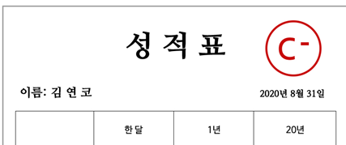

* 위 이슈는 이렇다. 앞서 선택한 항목별 개수들에 대해 전체 성적을 매기고, 그에 따라 다른 이미지 및 값들이 출력되어야 했다. 물론 view 딴에서 모두 쓸 수도 있지만, 최대한 객체지향적으로 했으면 하는 마음에... CalculateService 클래스를 만들고 Controller의 필드로 선언해주었다.

<br/>

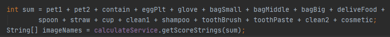

* 여기서 사용할 것은 각 항목의 총 개수 합을 계산해서, 총합에 따라 출력될 성적이미지, 문구이미지가 달라져야 했다.

<br/>


* 따라서 CalculateService에 총합을 넘겨주고, 개수에 따라서 출력할 이미지 이름을 String으로 지정하여 두 이미지 이름 배열을 반환하도록 구현했다.

<br/>

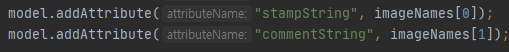

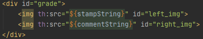

* 해당 key값과 value로 넘겨 템플릿 속성을 이용해 src에서 해당 문자열을 출력해주면 끝!

<br/>

### 2. Button onclick function - data 처리 문제

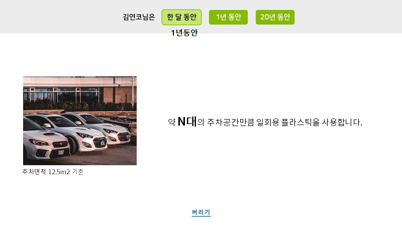

* 다음 이슈는, 누르는 버튼에 따라 화면 출력이 달라지는 경우에 대해 구현해야 했다. 뭐, Button onclick 속성을 적용하여 js function을 정의해서 사용하면 되겠지 싶었다.
* 출력까지는 상관 없는데, 이번에도 역시 데이터가 문제였다. 저 N이라는 계산된 값을 어떻게 가져오지? 해당 값은, 앞선 survey1, 2, 3 탭에서 선택한 값들에다 각각에 맞는 수치들을 곱한 후 모두 더해서 1년(12), 20년(240), 평생(1200) 시간으로 곱한 뒤 해당 단위로 나눈 값이 정수형태로 출력되어야 한다.

<br/>

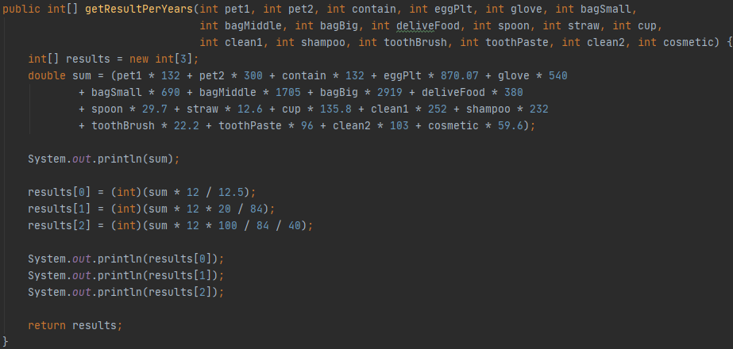

* 따라서 우선 해당 식은 CalculateService라는 파일로 객체를 만들어서 Controller에서 불러 요청하는 형식으로 값을 불러왔다. 1년 단위, 20년 단위, 100년 단위로 각 수치별로 곱하고 더하고 나누어 계산하여 배열에 담아 반환하였다.

<br/>

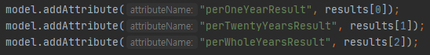

* 이 값을 어떻게 활용해야할까. 고민을 많이 했다. Button onclick script 함수로 만들어서 하려고 했으나, '넘어온 데이터를 onclick으로 누를 때 마다 내용에 반영하는 방법'은 뭘까... 전에 썼던 setAttribute 속성으로 하려 시도했다. 근데 이런 저런 방법을 해도 안되고, 템플릿 text 속성을 활용해도 500Error 등 데이터 파싱 오류가 지속적으로 발생하며 삽질을 거듭했다..

<br/>

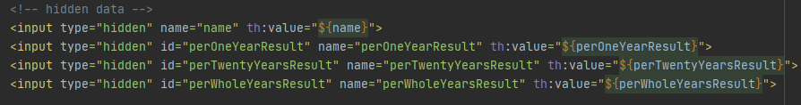

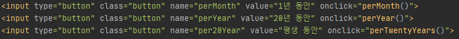

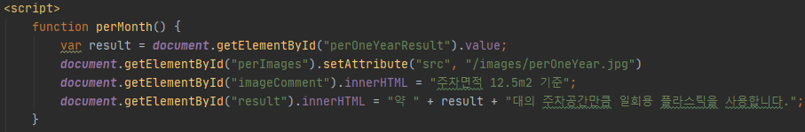

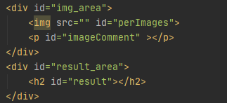

* 여러 시행착오 끝에 선택한 방법은, 해당 데이터를 hidden 상태로 페이지상에 저장해놓는 것이었다. 또한, p태그나 h관련 태그들은 속성으로 넣는 것이 아니라 innerHTML을 활용해 넣는다고 한다!!
* 위와 같은 코드로.. 페이지에 hidden type으로 데이터를 받아서 가지고 있다가 button이 클릭 되면 onclick action으로 각 script 함수들이 수행되어 document의 해당 id에 해당하는 태그에 innerHTML 을 통해 string 형식으로 값이 대입된다. 해결!

<br/>

#### 3. Button onclick function - style 변경 및 data 처리 문제

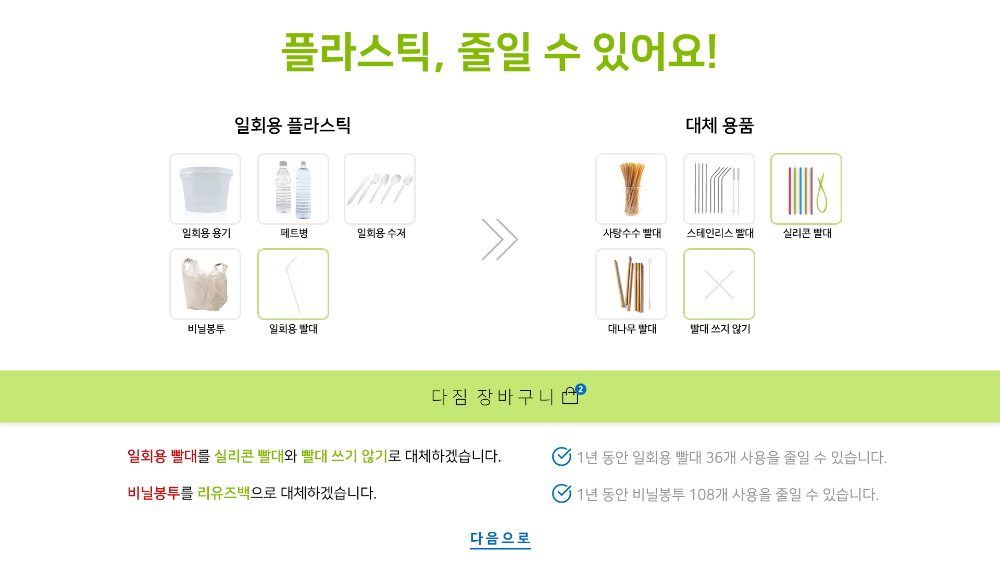

* 나중에 알려준 요청사항으로.. 어찌보면 UI 전문 경험이 없던 나에겐 가장 복잡하다고 느낄 수 있는 페이지였다. PPT로 만들었으니 요청은 쉽겠지...? 허허.. 또 막막하긴 했지만... 도전.
* 먼저, Layout 부터 나누었다. 상단 header / 선택할 부분 content를 left , center, right로 / 다짐 장바구니 bottom content / 선택 항목에 따라 텍스트가 추가 될 text content.

<br/>


* 다음은, 눌렀을 때 반응하는 css 변경이다. 해당 속성들은 setAttribute로 변경하는 것이 아니라 css 속성이기 때문에 style.attribute로 접근해야 했다. 그걸 몰라서 또 한참 삽질을 하다가..
* 누르는 항목에 따라 출력하고 싶은 해당 div 전체를 display 속성값 block 또는 none 하여, 보이거나 숨기고를 동시에 함으로서 해당 div 만 보이도록 구현하였다.
* 이 역시 기본적으로는 onclick을 통한 script 함수를 활용했다.

<br/>

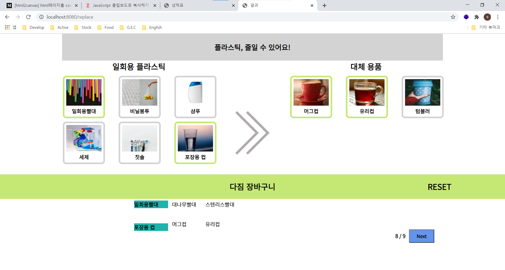

* 정리하면 이렇다. 좌측 '일회용 플라스틱' 항목을 선택하면 해당 항목은 연두색 테두리로 select 효과를 주고, 그에 대응하는 대체 용품 화면을 보여준다. 다시 누르면 선택 항목과 대체용품 화면이 사라진다.
* 대체 용품 화면에서도 css 효과는 똑같다. 누르면 강조, 다시 누르면 취소. 토글식으로 구현하였다.
* 하지만 양쪽 항목 모두, 최대 두 개씩 선택할 수 있도록 개수 제한을 두었다..

<br/>

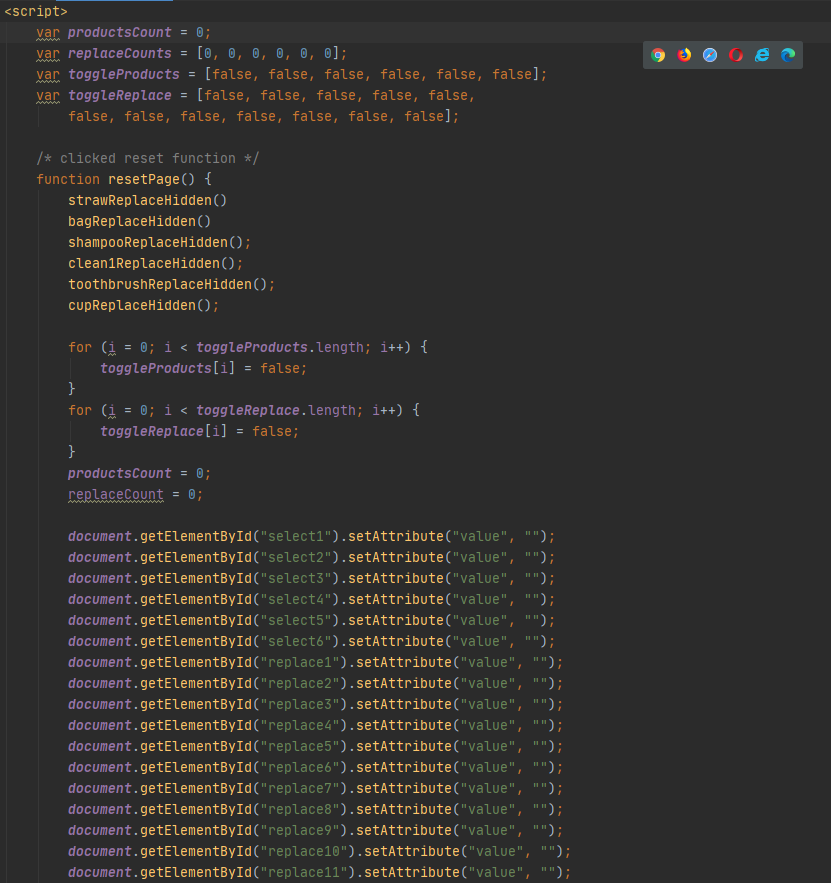

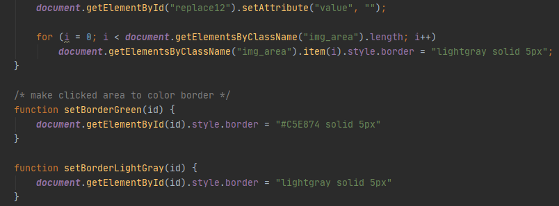

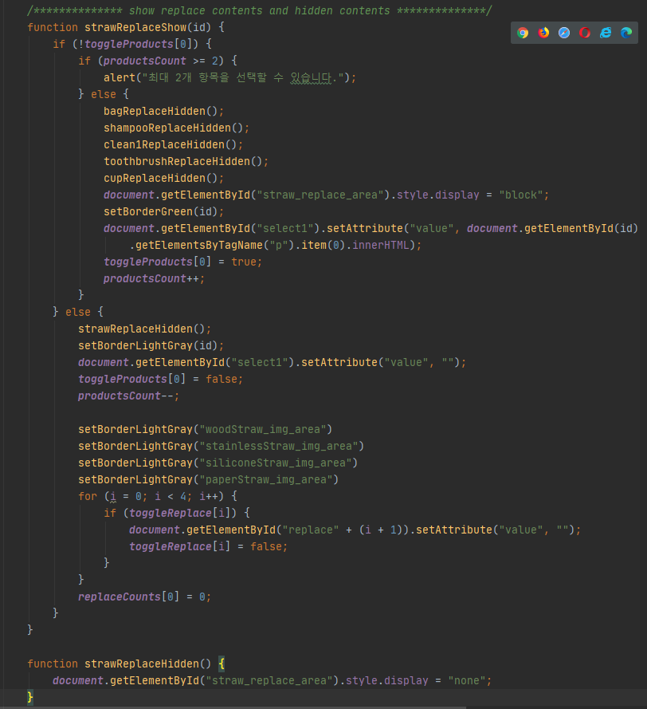

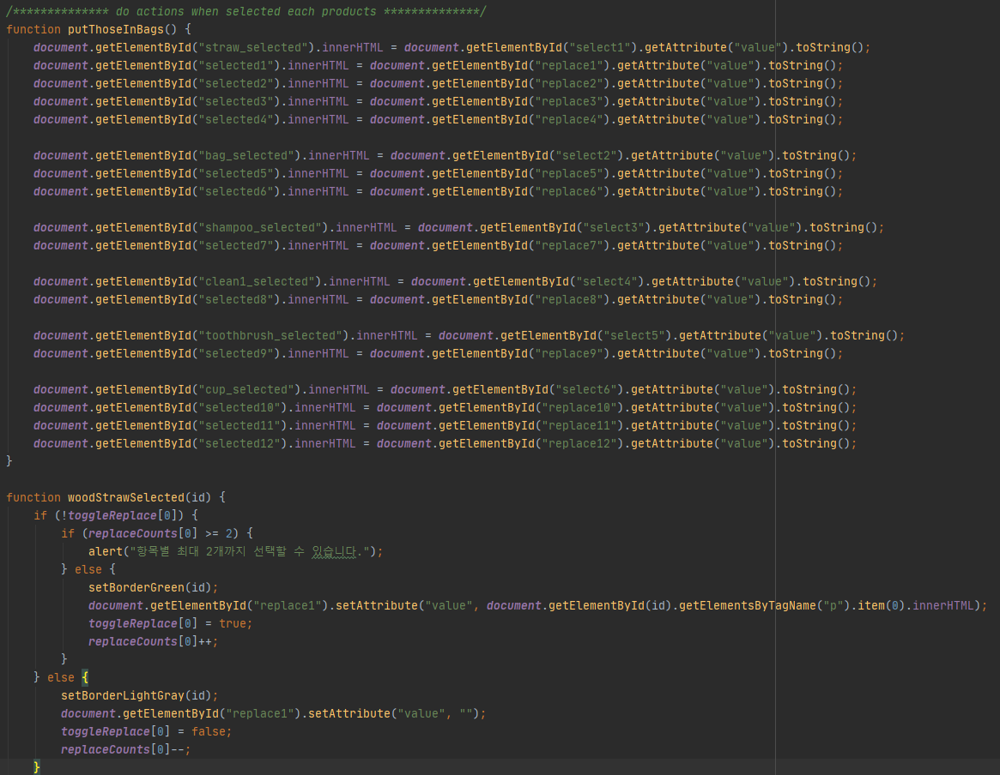

* 그래 뭐... 900% 순전히 노가다였다. 이 한 페이지 구현에만 900줄이 넘는다. 그 중 절반 이상이 script 코드였다. 물론... 더 줄일 수 있겠지... 고민을 더 깊이, 더 자세히 하면 분명 중복되는 기능인 함수들에 대해 1/10로 줄일 수 있겠지... 하지만 잘 돌아가는 지금... 줄이려는 의욕은 상실했다. 그냥 일단 돌아가니 그대로 두자. 구현 자체가 목적이 아닌가. 서비스가 목적인 프로젝트는 아니지 않은가.
* 선택한 전체를 리셋하는 기능을 하는 RESET 버튼이 존재한다. 또, 각각의 항목마다 onclick 함수가 적용되어야 했기에, 각각 다른 id로 다른 name으로 함수들을 제각각 다 구현해주었다. <u>(그래서 스크립트만 500줄이 넘는다..)</u>  css를 적용하는 항목들에 대한 함수, display 속성에 대해 none과 block 해주는 함수, 선택 가능한 항목의 개수도 조절하고 안내 메시지를 출력해주는 함수...
* 내가 봐도 맘에 안드는 노가다 코드다. 인정하지만.. 반복하지만.. 나중에. 그래도 구현 되었잖은가? :)

<br/>

### Client - Server 간 데이터 이동 - 선택된 항목 전달하기

#### sixth issue

* 이전 페이지에서 선택된 항목들에 대해 다음 페이지로 전달해야 했다. 선택된 항목이 마지막 페이지에 문자열로 나와야 했으니까.

<br/>

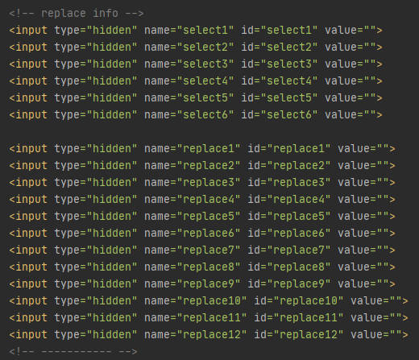

* 일단 전에 전달했던 방법은 노가다로, input 태그 안에 type속성을 hidden으로 숨겨 페이지에 정보를 저장한 채로 @RequestParam을 이용한 전달하는 방법을 사용해왔다.

* 그의 연장선이긴 했으나, 그럼 해당 전달 받은 데이터들을 어떻게 판별하여 빈칸이 아닌것만 골라낼까?

<br/>

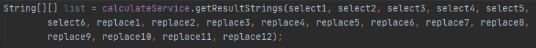

* 언제부터 그렇게 신경 써왔냐만은... 꼴에 그래도 명색이 MVC 모델인데, 데이터 처리는 서비스를 통해서 하고 싶었다. 그래서 (노가다로) 모든 정보를 하나하나 넘겨서, CalculateService 객체를 통해서 데이터를 가공하기로 했다.

<br/>


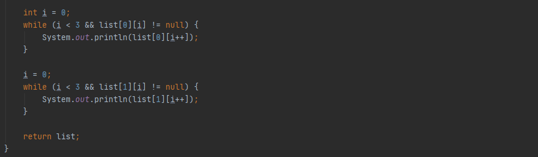

* 와. 이런 데이터 다루는 코드를 너무 안짠지 오래 되었나보다. 이번 코딩을 통해 느낀거지만, 일단 되면 된다는 마음가짐으로 하다보니까, "효율적이고 좋은 코드" 보다는 노가다가 많은 것 같다. 하나하나 해보는거.
* 내용물이 비어있으면 (.equal("")) pass하고, 비어있지 않은 것(!)만 임시변수에 저장하여, 순서를 구분해서 2차원 배열로 만들어 반환하기로 했다. 그룹별로 지어야 할 것 아닌가. 어떤 물품을 - 어떤 것으로 대체할 것인지를 담은 정보니까.

<br/>

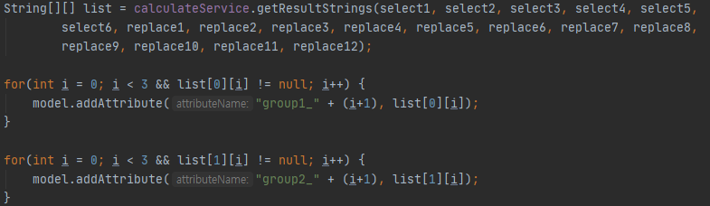

* Service에서 가공하여 받아온 list 정보는 전 페이지에서 일회용품 2개, 그에 따른 대체 물품을 각각 2개까지 선택할 수 있었기 때문에, group1과 2로 나누어 전달한다.

<br/>

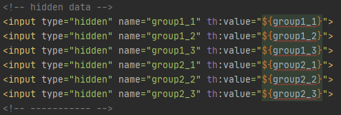

* 그럼 전달되는 다음 화면에 hidden 형태로 내용을 가지고 있는다.

<br/>

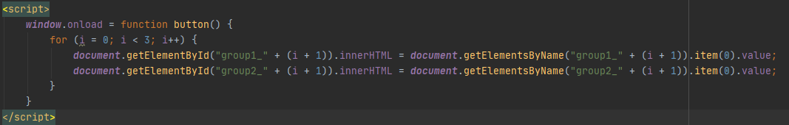

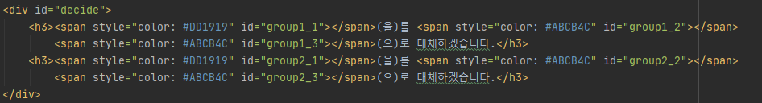

* 이 때, 화면에 전달된 정보가 출력되어야 하니 이전에 썼던 방법을 응용하려 했다. 하지만, 버튼을 누르면 출력되도록 했던 이전과는 달리, 해당 페이지가 나오자마자 데이터가 출력되어야 했다.
* 따라서, window.onload와  $(document).ready() 두 가지 방법 중 전자를 선택했다. HTML과 CSS 등 모든 요소들이 다 로드되어야 호출되며, 한 번만 수행되는 방식의 함수였다.

[참고](https://hsj306.tistory.com/60)

<br/>

### 공유하기 Button link

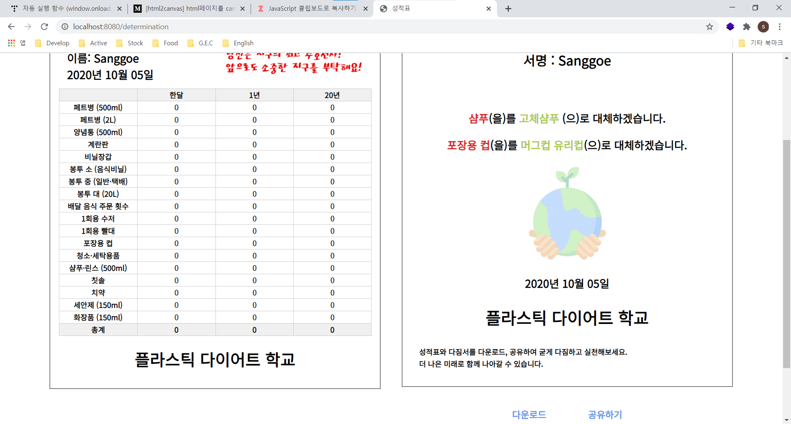

* 공유하기 버튼을 누르면 해당 페이지의 링크가 복사되어, 다른 사람에게 공유할 수 있도록 해달라는 요청이었다. 정말.. 많은 고민을 했다. 어떤 방법이 있을까.
* 해당 화면의 경우 DB를 이용하는 것도 아니고, 일회성 페이지이기 때문에... 링크를 공유한다고 해도  해당 페이지의 데이터를 모두 가지고 있지 않는 한 똑같은 페이지를 출력할 방법이 있을까 싶었다.

<br/>

* 먼저 생각한 것은 다운로드 문제를 이용한 방법이였다. 해당 문제가 해결이 된다면, 서버에 이미지를 저장하고, 그 링크를 주소로 사용하는 것. 
  * 그에 따라서 첫 번째 이슈는, 이미지가 계속해서 축적 될텐데 어느 주기로 지워줘야 할 것인가? 였다. 실제 '서비스를 구현' 하는 입장이라면 서버의 데이터 정리 문제도 큰 이슈였겠지만, 서비스 구현보다는 일회성 페이지를 이용하는 사람이 그렇게 많지는 않을 것이라는 판단이 들었다.
  *  두 번째 이슈는, Unique 한 고유 주소가 필요할 텐데 그것을 어떻게 할 것이냐의 이슈였다. 이 부분은 int값을 고유 주소로 주어 한 번 공유하기로 이미지가 서버에 저장될 때마다 해당 int값을 1씩 증가시켜서 만들면 될 것 같았다. int형 정수의 가장 max값인 2147483647번 만큼은 공유하기 버튼을 누르지 않을 것 같았으며, 첫 번째 이슈와 마찬가지로 그렇게 많은 인원이 서비스를 이용할 것이 아니었기 때문에.
* 두 번째로 생각한 것은 Post 방식이 아닌 Get 방식의 활용이었다. 물론 수많은 데이터를 주소창에 Key-Value 값으로 그렇게 다 주는 것이 좋은 방법은 아닐 것 같았지만, 뭐 불가능 한 것은 아니라고 보았다. 어차피 해당 html 틀은 모두 공통으로 사용하는 것이고, 거기에 전달되는 데이터만 존재한다면 key값과 value에 맞는 위치에 매칭되어 잘 전달될 것이 아닌가. 다만 Controller에 Get방식으로 Mapping된 함수만 존재하면 될 일이었다. 아직 이미지 다운로드 부분이 해결되지 않았기에, 이 방법을 선택하기로 했다.

<br/>


[참고](https://zetawiki.com/wiki/JavaScript_%ED%81%B4%EB%A6%BD%EB%B3%B4%EB%93%9C%EB%A1%9C_%EB%B3%B5%EC%82%AC%ED%95%98%EA%B8%B0)

<br/>

<br/>

### jar 파일로 빌드 후 배포 문제

* 정말 중요한 issue 였다. 로컬 환경에서는 구현이 다 끝났고 자체 톰캣 서버에서는 오류 없이 실행이 다 잘 되었다. 이제 서버에 올리기만 하면 끝나는 문제.
* Spring boot의 좋은 점이, 톰캣 was 서버까지 내장하여 한번에 jar라는 확장자로 만들어 손쉽게 배포할 수 있다는 점이었다.

<br/>

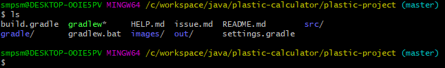

* 해당 프로젝트파일의 root directory에 와보면, gradlew 라는 배치파일이 있다. 이것을 이용해 손쉽게 빌드 할 수 있다고 한다.

<br/>

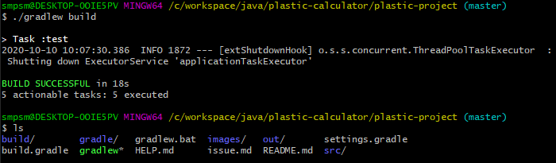

* `./gradlew build` 명령어로 해당 프로젝트를 jar 파일로 빌드 할 수 있다.
* 해당 명령어를 수행하면 Build 하여 build라는 폴더가 생기게 된다.

<br/>

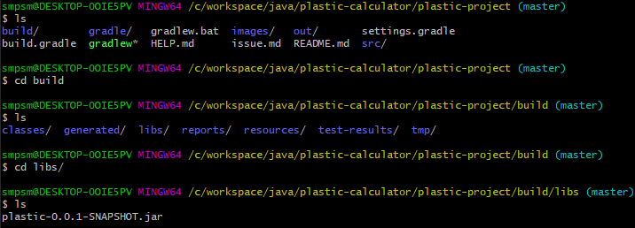

* `build` - `libs` 폴더에 들어가면 `plastic-0.0.1-SNAPSHOT.jar` 파일이 생성된 것을 확인할 수 있다.

<br/>

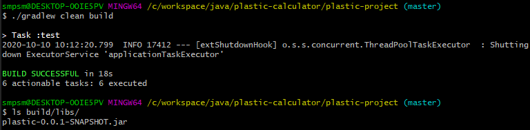

* `./gradlew clean` 명령어는 해당 build 폴더 전체를 삭제시킨다. 따라서 만약 빌드나 배포가 잘 안되는 경우, `./gradlew clean build` 명령어로 해당 프로젝트를 jar 파일로 깔끔하게 다시 빌드 할 수 있다.

<br/>

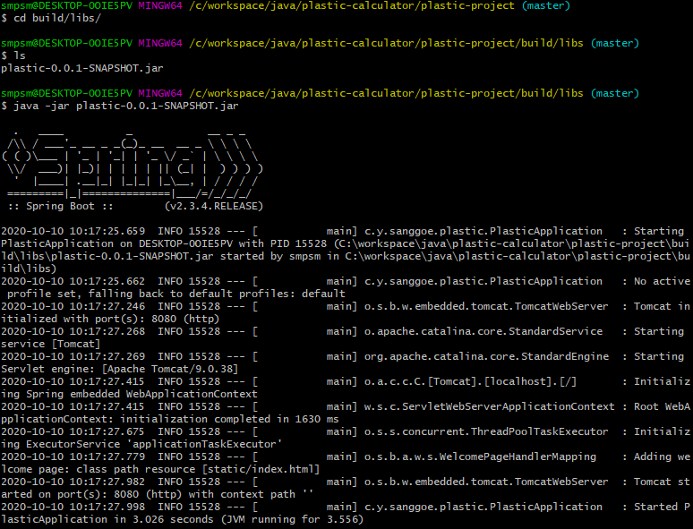

* 배포도 쉽다. 해당 폴더로 들어가서 build된 jar 파일을 확인한다.
* `java -jar plastic-0.0.1-SNAPSHOT.jar` 명령어를 이용해 배포하면 끝!
* 아래 스프링 특유의 문구가 성공적으로 나오는 것을 볼 수 있다.

<br/>

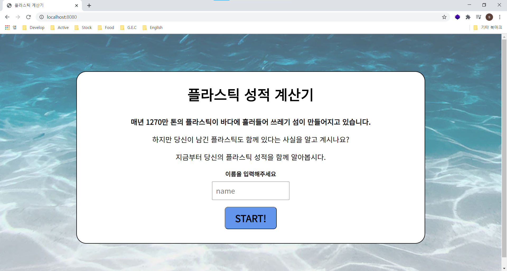

* jar 파일로 만들어 local을 서버삼아 배포한 것이니, 반은 성공한 것이라고 볼 수 있다. 감격의 순간..!  ...도 잠시. 다음 페이지 버튼을 누르니 바로 에러가 나왔다.

<br/>

### 배포 후 issue - error server, status 500

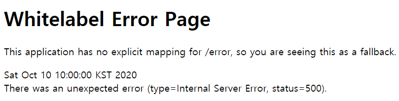

* 페이지 오류가 떴다. 배포도 처음이고, 배포 한 후 에러에 대해서도 처음 접하기 때문에 정말 막막했다. 에러 코드를 먼저 살펴보았다.
* status=500은 지난번에 syntax오류 때 보았던 상태였던 것 같은데.. intelliJ 상에서 로컬 서버를 자체적으로 구동시켜 수행할 때는 아무 문제 없이 수행 되었던거 보면, 각 페이지들의 syntax 문제는 아닐 것 같았다.
* mapping for /error?? 매핑에 문제 있는 것일까? 이 역시 controller에서 GetMapping, PostMapping으로 잘 해주었는데.. intelliJ 상에서 마찬가지로 문제 없이 잘 수행되었는데..

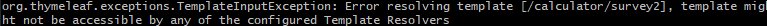

* 웹 페이지가 아닌 서버 구동 콘솔에 표시된 에러도 확인해 보았다.

  * ```
    org.thymeleaf.exceptions.TemplateInputException: Error resolving template [/calculator/survey2], template might not ht not be accessible by any of the configured Template Resolvers
    ```

  * 템플릿 오류?? 해당 템플릿 파일에 접근할 수 없다는 내용의 오류인 것 같다. 흠...

<br/>

* 별 수 있나. 우선 구글링 해봤다. stackoverflow에 달린 `mapping for /error` 관련 질문은 도움이 되지 않았다.  [참고](https://stackoverflow.com/questions/31134333/this-application-has-no-explicit-mapping-for-error)
* 먼저 경로상에 문제가 있는지 확인하는 것이었다. Application.java 실행 파일이 상위에 있고 그 하위 패키지들에 다른 파일들이 존재하는지 확인하라는 것. 전혀 문제 없었다.
* 또한, 해당 사용자는 localhost:8080 페이지 조차 표시하지 못한다고 하니, 나와 다른 상황에서의 증상인 것 같았다.

<br/>

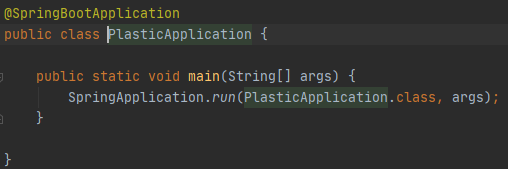

* 다음은 `@SpringBootApplication` 주석 등 어노테이션 문제 답변이 있었다. 고맙지만, 내 코드에서는 문제 없었다. 도움되지 않았던 답변. 그 외에도 이런저런 글들도 도움은 안됐다.
* 웹 페이지 자체의 문제일까? 도 생각되어 찾아보았지만, 웹 페이지 내에서의 출력 형식 문제는 아닌 것 같았다. [참고](https://m.blog.naver.com/rladnfls0500/221492239422)

<br/>

#### solution

* 그래도 일단 첫 페이지 home.html은 나오니까, 배포 자체에 문제는 없었다. 이번엔, `mapping for /error` 는 무엇일까, 이 키워드로도 검색해 보았다.
* 그리고 여럿 탐방한 결과, 나와 정확히 일치하는 에러를 경험한 사람을 찾았다. 로컬에서 돌릴 때는 아무 이상이 없었는데, jar배포 후에 문제가 발생한 경우!! 이 사람은 문제 상황 이해를 위해 레퍼런스를 찾아보았다고 한다. (나도 실천해야겠다.)

<br/>

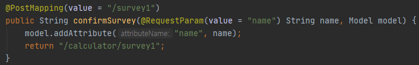

* jar 파일에서 classpath의 default 값은, `public/`, `resources/`, `static/`, `templates/`, `META-INF/**`, `*` 라고 한다. 즉, 결과만 단순히 말하면, 반환하는 주소에 /를 써서 그런 것이었다. IDE에서는 // 에 대한 처리를 해주지만, jar 배포시에는 처리해주지 못한다고 한다.
* 즉, //calculator/ 이라는 경로에 존재하는 survey1.html 파일을 찾았으니, 매핑 오류가 발생했던 것이다. `return "calculator/survey1"` 으로 수정하니 바로 됐다. 너무 행복하다.
* [참고](https://myserena.tistory.com/155)

